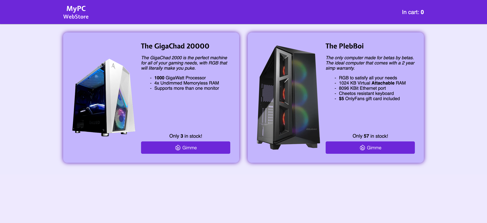
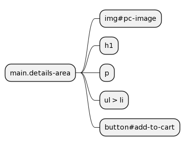

# MyPC

## Introduction
In this assignment, you are tasked with creating a website called "MyPC". The site contains two computers, _The Gigachad
2000_ and _The PlebBoi_.

The purpose of this assignment is to get you more acquainted with the basics of HTML and the surrounding technologies
such as JavaScript and CSS.

Your application will be tested automatically by ScalableTeaching. We are going to provide you with a base application.

**Disclaimer:** Unless otherwise instructed, do not in any way, modify the contents of the `/tests` directory or the `.gitlab-ci.yml` file. Doing so will be considered cheating, and will in the best case result in your assignment being failed.

## Setup

1. Clone your project locally.
2. Run `composer install` to install php dependencies.
3. Create a copy of the .env.example file named .env. This can be done with the command `cp .env.example .env`
4. Run `php artisan key:generate` to generate a random encryption key for your application
5. Run `php artisan serve` to boot up your application

### Testing your solution

Every time you push your code to our source control (gitlab.sdu.dk) (which you will have to do to pass), your code will be validated to see if it meets the requirements of this assignment. This can be slow, especially if other people are also doing it simultaneously (then you will most likely be put in a queue). To mitigate this, you can run your tests locally. 

#### Running browser tests

You should run our browser tests using Laravel Dusk.

The first time you run the tests on your machine, you will have to install the latest `Chrome` binaries; this can be done with the `php artisan dusk:chrome-driver` command (make sure you have the latest version of chrome).

In another terminal, run `php artisan serve` - this is needed as dusk actively uses the server to test your implementation. Make sure the server is up and running every time you test your implementation.

In your main terminal, run: `php artisan dusk` and `php artisan test` - this will start running your tests.

### Debugging Screenshots

The tests are by default running in sequential order with the `php artisan dusk` command. However, you can specify a filter to test the specific functionality of the application with the `php artisan dusk --filter` command.

Naturally, when the tests are running, the developer doesn't have any visual insight into the progress of the test, unless using the `--browse` argument is included. However, a screenshot will be generated in the folder: Tests/Browser/Screenshots/..., which might help debug the currently failing test.

## The application

The application has three URLs:

- `/` - Lists the two computers
- `/gigachad` - The GigaChad 2000 Details Page
- `/plebboi` - PlebBoi Details Page

The example images can be used as a reference when you are creating your site.

We impose some requirements on you, however, you are free to design your site within those. The requirements will be
further explored in the coming sections as well.

The assignment uses query selectors extensively to reference elements. 
To summarize:
 - `div p` refers to a `p` tag that is nested __at some point__ within a `div`
 - `div > img` refers to a `img` that is nested __immediately__ within a `div`
 - `div#test` refers to a `div` with an id of `#test`
 - `div.hello.world` refers to a `div` with a class of `hello` and `world`
 - You can read more [here](https://developer.mozilla.org/en-US/docs/Web/API/Document/querySelector).

**Important**, when referencing files in the public folder, use the `{{ asset('file') }}` method.

### Files of significance

During this assignment you will be working with the current files:

- `public/js/add-to-cart.js` - Responsible for incrementing the _"In cart"_ counter (seen in the upper right corner).
  Loaded by default. 
- `public/styles/primary.css` - Default CSS provided by us. Loaded by default.
- `public/styles/custom.css` - The recommended place for __your__ CSS. Loaded by default.
- `resources/views/index.blade.php` - Contains HTML for the index page
- `resoruces/views/gigachad.blade.php` - Contains HTML for the GigaChad 2000 details page
- `resources/views/plebboi.blade.php` - Contains HTML for the PlebBoi details page

We have provided a default skeleton for each of the three pages containing the HTML for the navbar `nav` and a container.

You may have noticed that the `php` files have a `.blade.php` extension. Files with this extension will be processed by Laravel's templating engine _Blade_. It supports the HTML syntax as well as some code execution that will be introduced later in the course. If you're curious you can read more [here](https://laravel.com/docs/9.x/blade#main-content).

## Index Page

The Index page contains a navbar `<nav>` and a `<main>` element. The `<main>` element serves as the place for your PC sections to live
in. Make sure it is using the [grid](https://developer.mozilla.org/en-US/docs/Learn/CSS/CSS_layout/Grids) display style.
Each PC section must have its respective HTML element with the class `pc`, within the `<main>` element.

Each PC section should have the following elements:

- `image` - show the image of the respective computer (`/public/img/pc1.png` for The GigaChad
  200, `/public/img/pc2.png` for The PlebBoi)
- `h2` - Containing the name of the pc
- `p` - Containing an introductory text
- `ul > li` - An unordered list containing a list of specifications for the computer
- `a.details-link` - A link that redirects the user to the PC's respective details page (`/gigachad` for The GigaChad
  200, `/plebboi` for The PlebBoi) (shown as "Gimme" in the example image). This link should have the same background
  color as the `<nav>` element.

Please note that the ordering is important, such that _The GigaChad 2000_ is shown before _The PlebBoi_

The structure explained above can also be seen here:

### Requirements

| Name                              | Description                                                                                                              | Tests |
|-----------------------------------|--------------------------------------------------------------------------------------------------------------------------|------|
| Title                             | The title of the HTML page should contain "MyPC"                                                                         | `php artisan dusk --filter IndexTest::testTitle` |
| Logo goes to /                    | Change the link in the <nav> such that it redirects to the home page (/)                                                | `php artisan dusk --filter IndexTest::testLogoGoesToHomePage` |
| Create `main`                     | Create a `<main>` element that can contain your computers                                                                | Combined with requirement below |
| `<main>` uses grid display style  | Set the display style to `grid` for the `<main>`element.                                                                 | `php artisan dusk --filter IndexTest::testHasMainWithGrid` |
| PC element                        | Create two `.pc` elements within the `<main>` element                                                                    | `php artisan dusk --filter IndexTest::testMainHasTwoPCs` |
| PC shows image                    | Create an image showing the computer within `.pc`.                                                                       | `php artisan dusk --filter IndexTest::testEachPCHasTheirRespectiveImage` |
| PC shows title                    | Create an `<h2>` within `.pc` that display the name of the computer                                                      | `php artisan dusk --filter IndexTest::testEachPCHasAH2Title` |
| PC shows an introduction          | Create a `
` that display an introductory text about the computer                                                      | `php artisan dusk --filter IndexTest::testEachPCHasAParagraph` |
| PC shows a list of specifications | Create a `<ul>` with some list items with the specs of the computer.                                                     | `php artisan dusk --filter IndexTest::testEachPCHasAListOfSpecs` |
| PC shows a details link           | Create an `<a>` that redirects the user to details page of the computer. This `<a>` should have the class `details-link` | `php artisan dusk --filter IndexTest::testEachPCRedirectsToTheirRespectivePage` |
| Matching styles                   | The background color of the <nav> should match the background color of the `a.details-link`                             | `php artisan dusk --filter IndexTest::testColorsMatch` |

## TheGigaChad 2000 Page

This page should show the GigaChad 2000 computer and the details about it. However, before getting started you should fill in code in
`add-to-cart.js`. This script should increment the _in cart counter_ when called, such that for each time it is invoked the counter displays:
- In cart: 1
- In cart: 2
- In cart: 3
- and so on

**Please note**, we don't expect the counter to be persisted when you navigate through your site. It's completely fine that it resets when you go to a new page.

On to the Index page. This page contains a navbar `<nav>` and a `<main>` element, give this element a class of `details-area`.
Additionally, this element should use the `flex` display style.
Next up we need to relay some basic information about the GigaChad computer.

The `main.details-area` should have the following elements:

- `image#pc-image` - Show the image of the computer (`/public/img/pc1.png`). This element should have an id
  of `pc-image`
- `h1` - Containing the name of the pc (should have the same color as the background color of the `<nav>`)
- `p` - Containing an introductory text
- `ul > li` - An unordered list containing a list of specifications for the computer
- `button#add-to-cart` - A button that lets you "add it to the cart", such that the counter in the `<nav>` is
  incremented. It invokes the code in your `add-to-cart.js` file, that you implemented earlier. This button should have the same background
  color as the background color of the `<nav>`.

The structure can be seen here:

| Name                             | Description                                                                                                                           | Tests |
|----------------------------------|---------------------------------------------------------------------------------------------------------------------------------------|-------|
| Title                            | The title of the HTML page should contain "MyPC" and "The GigaChad 2000"                                                              | `php artisan dusk --filter GigaChadTest::testTitle` |
| Logo goes to /                   | Change the link in the `nav` such that it redirects to the home page (/)                                                             | `php artisan dusk --filter GigaChadTest::testLogoGoesToHomePage` |
| Update `main`                    | Update the `<main>` element to have the class `details-area`.                                                                         | `php artisan dusk --filter GigaChadTest::testMainElementExists` |
| `<main>` uses flex display style | Set the display style to `flex` for the `<main>`element.                                                                              | `php artisan dusk --filter GigaChadTest::testMainElementUsesFlexbox` |
| Image                            | Create an image with id `pc-image` that shows the image of the GigaChad (`pc1.png`).                                                  | `php artisan dusk --filter GigaChadTest::testPCImageWithinDetailsArea` |
| Title                            | Create an `<h1>` that display the name of the computer                                                                                | `php artisan dusk --filter GigaChadTest::testH1TitleWithinDetailsArea` |
| Introduction                     | Create a `
` that display an introductory text about the computer                                                                   | `php artisan dusk --filter GigaChadTest::testParagraphWithinDetailsArea` |
| List of specifications           | Create a `<ul>` with some list items with the specs of the computer.                                                                  | `php artisan dusk --filter GigaChadTest::testStatListWithinDetailsArea` |
| Add to cart                      | Create a `<button>` with id `add-to-cart` that increments the _in cart counter_.                                                      | `php artisan dusk --filter GigaChadTest::testAddToCart` |
| Matching styles                  | The color of the `h1` title and the background color of the _add to cart_ button should have the same background-color as the `nav`. | `php artisan dusk --filter GigaChadTest::testColorsMatch` |

## The PlebBoi Page

This page is exactly the same as the GigaChad page, however with one caveat; the user is able to pick one of three colors `red`, `green` and `blue`. When the user changes the `select` the image of the pc changes as seen below:

Furthermore, if the user hasn't picked a color variant the `button#add-to-cart` button should display an alert and not increment the _in cart counter_.

Within the `main.details-area` you should create a new element with the id `color-picker`. Within this newly created element we need:

- A `label` that binds to the select
- A `select` with an id of `color`
  - A disabled option that is chosen by default such that no color is chosen by default (you can use this for reference `<option disabled selected value>None</option>`)
  - An `option` with the **value** "red" that changes the `img#pc-image` image of the pc to `public/img/plebboi/red.png`
  - An `option` with the **value** "green" that changes the `img#pc-image` image of the pc to `public/img/plebboi/green.png`
  - An `option` with the **value** "blue" that changes the `img#pc-image` image of the pc to `public/img/plebboi/blue.png`

_Hint_: It may be worth looking into the [change](https://developer.mozilla.org/en-US/docs/Web/API/HTMLElement/change_event) event.

The structure of this page can be seen here:

### Requirements

The requirements use and builds upon the requirements in the `The GigaChad section`, with changed values to reflect the PlebBoi. 

| Name                   | Description                                                                                                                                                    | Tests |
|------------------------|----------------------------------------------------------------------------------------------------------------------------------------------------------------|-----|
| Title                  | The title of the HTML page should contain "MyPC" and "The PlebBoi"                                                                                             | `php artisan dusk --filter PlebBoiTest::testTitle` |
| Color Picker element   | Create an element within the `main.details-area` with the id `color-picker`                                                                                    | Combined with below |
| Label                  | Create a label within `#color-picker` that says `Pick color` and binds to the select element                                                                   | Combined with below |
| Select                 | Create a select with an id of `color`                                                                                                                          | `php artisan dusk --filter PlebBoiTest::testColorPickerWithinDetailsArea` |
| Select options         | Create four `option` elements within the `select#color`. One that defaults to `none` and one for each color `red`, `green` and `blue` with a respective value. | Combined with below |
| Select events          | When the select changes to one of the three colors the `img#pc-image` should be updated to reflect the color chosen.                                           | `php artisan dusk --filter PlebBoiTest::testRedVariant`, `php artisan dusk --filter PlebBoiTest::testGreenVariant`, `php artisan dusk --filter PlebBoiTest::testBlueVariant` | 
| Add to cart validation | The pc can only be added to cart if a color is chosen. Display an `alert` to the user indicating this and prevent the _in cart counter_ from incrementing.     | `php artisan dusk --filter PlebBoiTest::testNoVariantSelect` |
